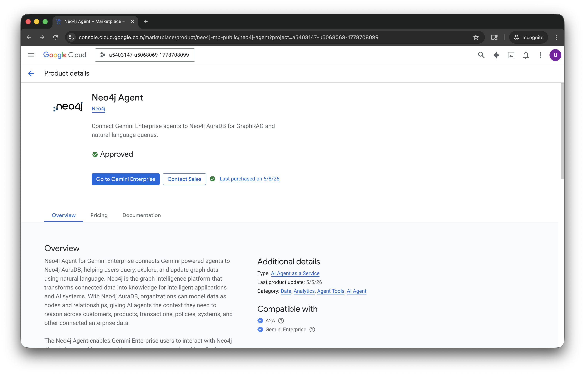
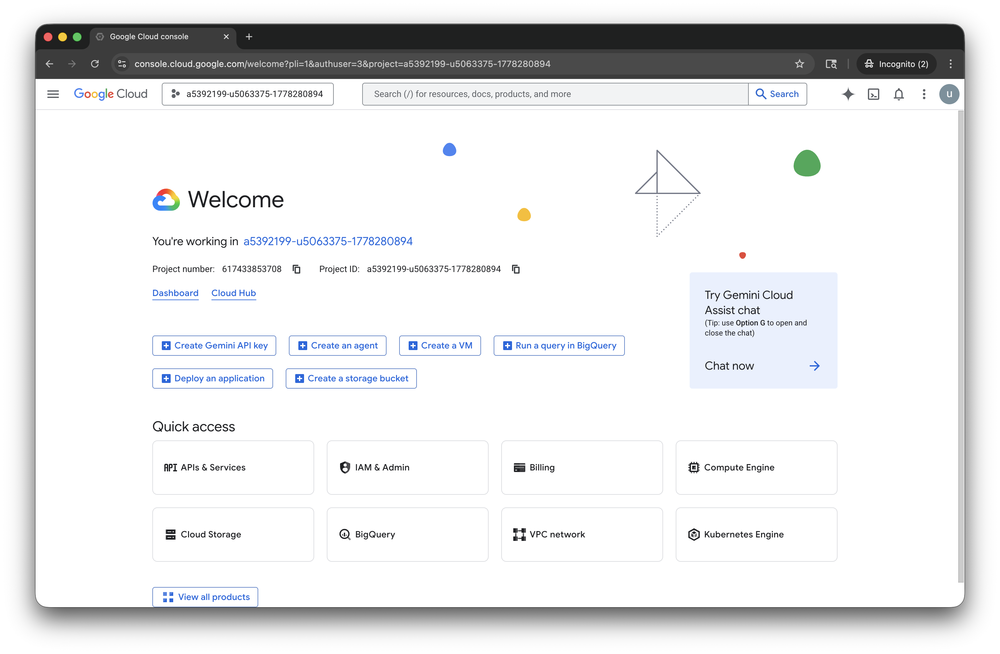
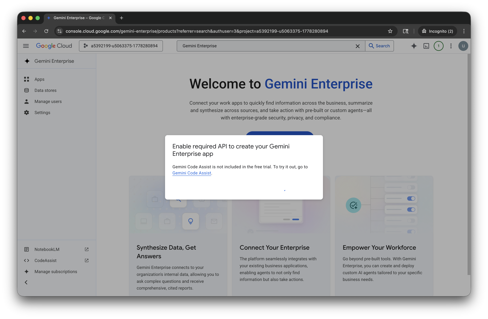
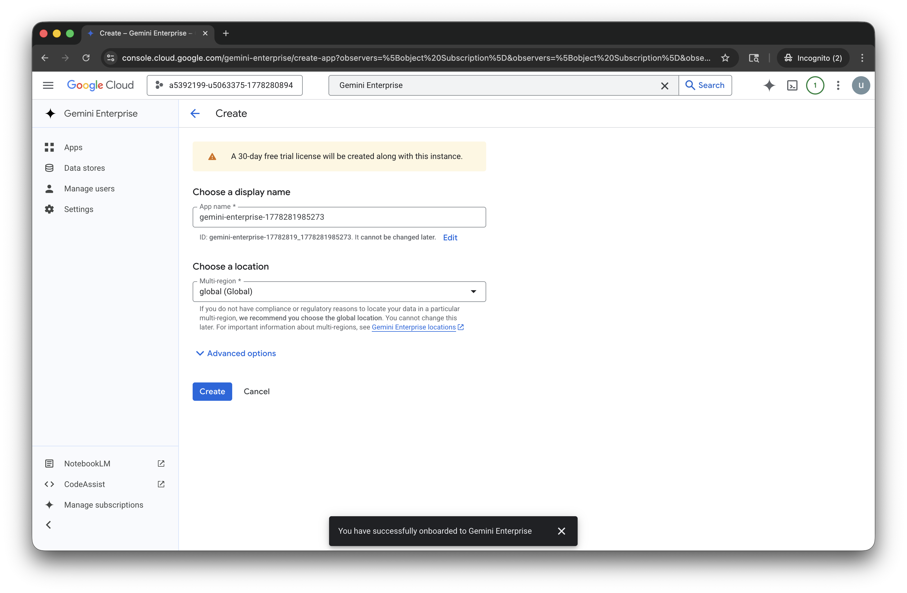
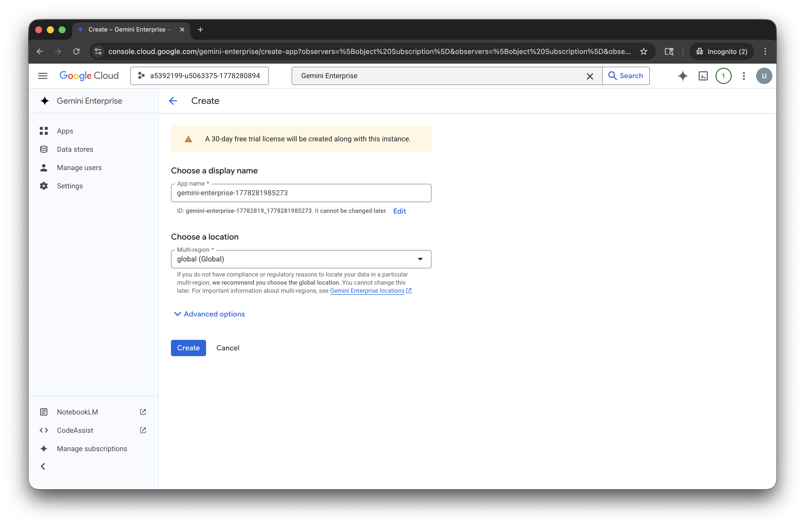
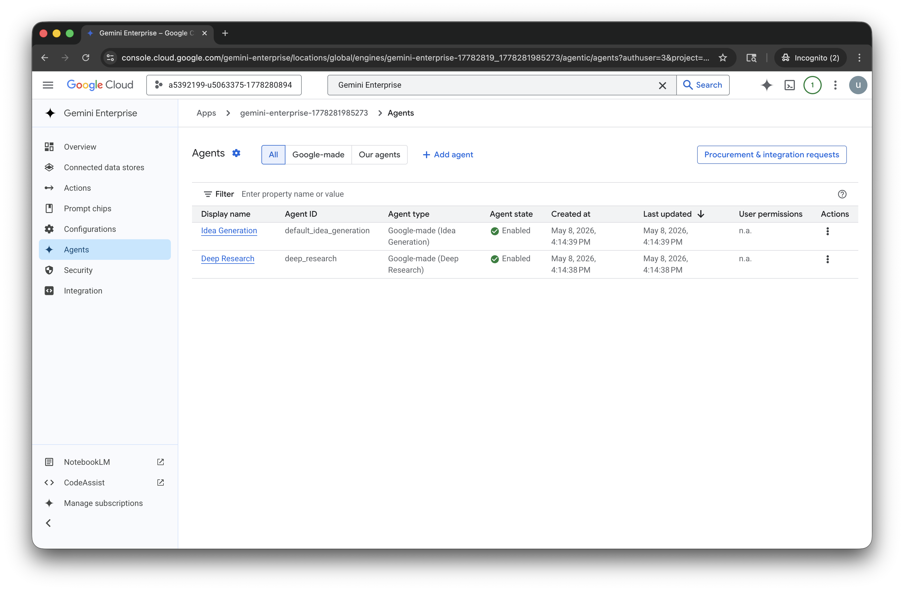
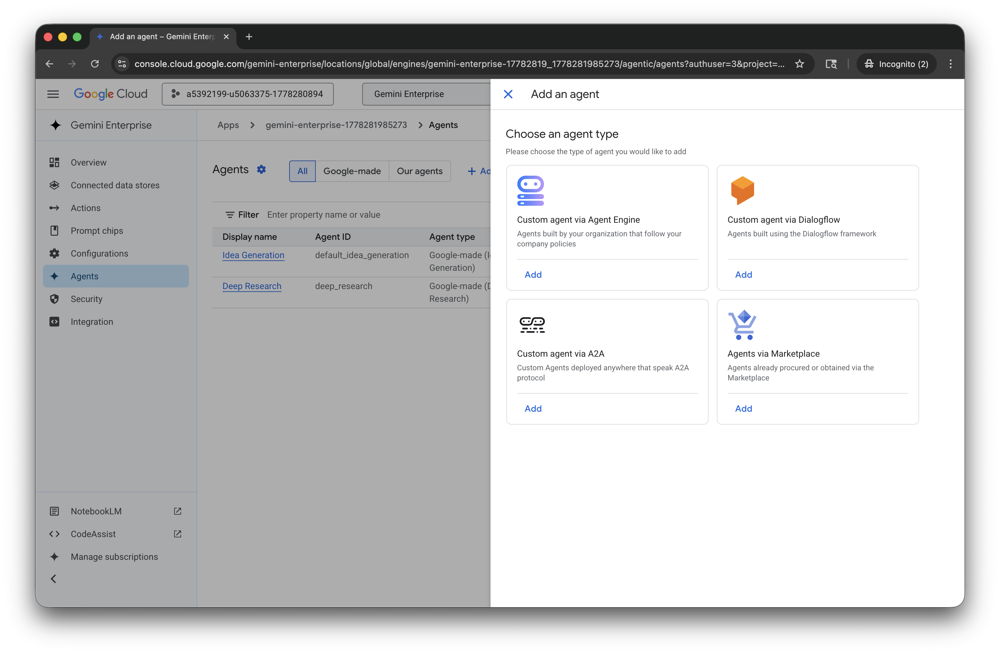
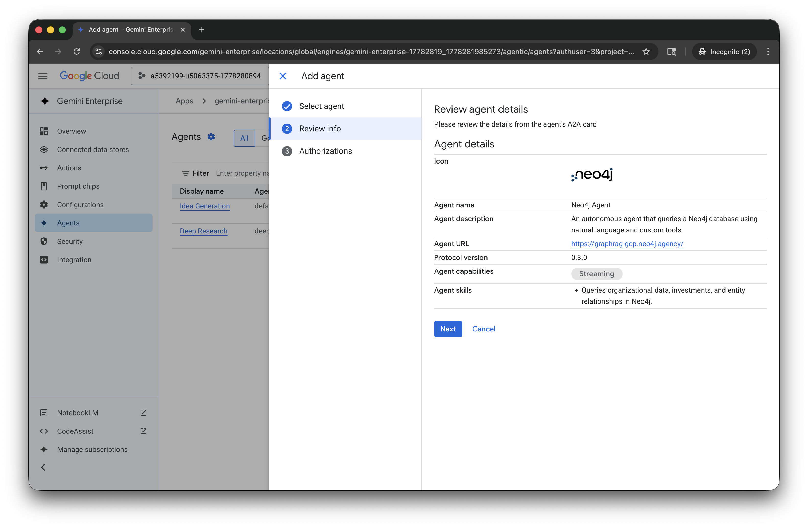
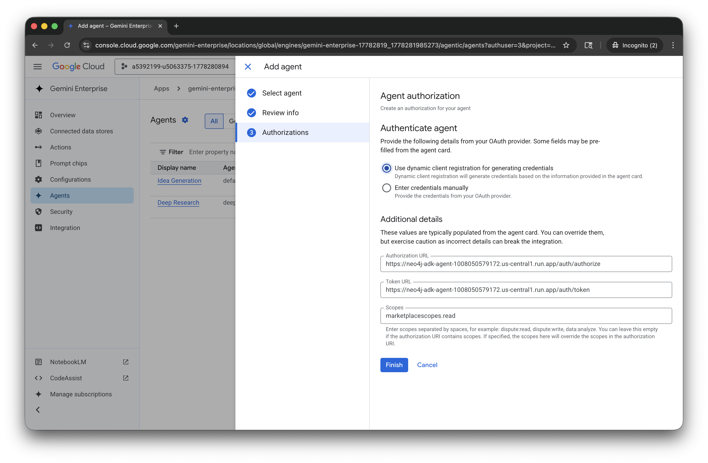
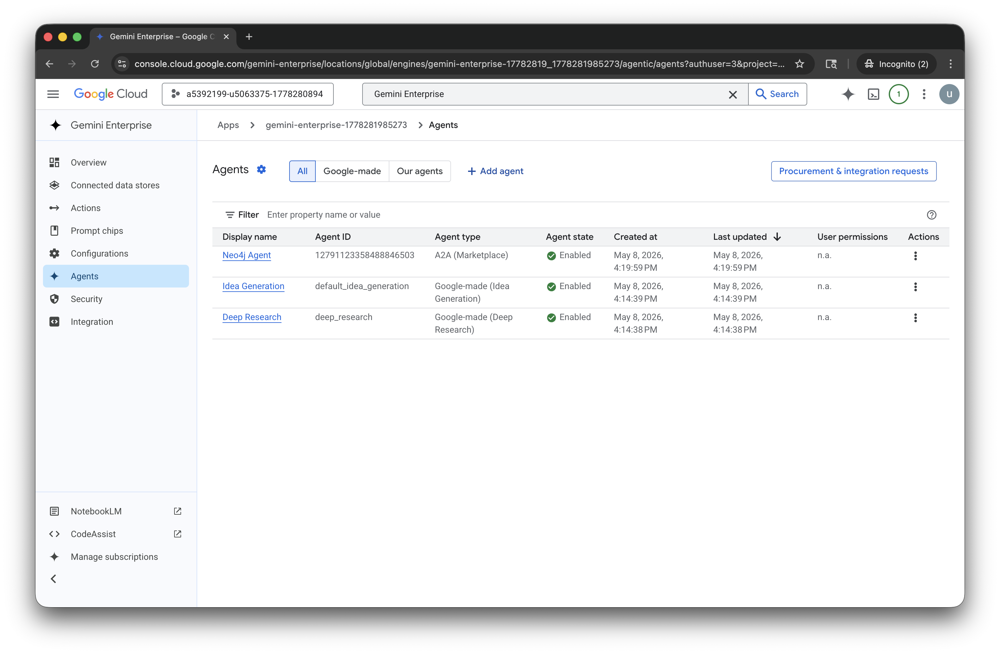

# Lab 7 - Deploy Neo4j Agent

In this lab we're going to use the Neo4j Agent in Google Cloud Marketplace with Gemini Enterprise.

The agent is an MCP server that can interact with a Neo4j Aura instance.  It can perform CRUD operations available through the Cypher language.  The agent takes natural language as input and converts that to the appropriate Cypher before passing the query to Neo4j Aura.

The Agent is available in the Google Cloud Marketplace.  It's wrapped in the Agent to Agent (A2A) protocol.  This means we can deploy it within a Gemini Enterprise environment.

So, let's get started.  You can open the Neo4j Agent listing [here](https://console.cloud.google.com/marketplace/product/neo4j-mp-public/neo4j-agent).  

Our administrator has already subscribed to this listing for us.  They've also configured it, connected to an AuraDB Business Critical intance.  If you're curious to understand the steps involved, you can read them [here](https://github.com/neo4j-labs/neo4j-agent-integrations/blob/main/google-gemini-enterprise/3-a2a-ge-marketplace/customer_guide.md).  In future versions of this lab we'd like to let you configure.  However due to a Vocareum restriction everyone is sharing a single billing account.  The result in that's not possible today.

Anyway... Let's go set Neo4j Agent up in Gemini Enterprise.  Click the "Go to Gemini Enterprise" button.

Click "Start 30-day free trial."

Click "Continue and activate the API."

That will run for a minute...

Dismiss the "You have successfully onboarded to Gemini Enterprise" dialog.

Click "Create."

Dismiss "App created successfully."

Click on "Agents" in the menu on the left.

Click "+ Add Agent."

On the "Agents via Marketplace" tile click "Add."

Select "Neo4j Agent by Neo4j" and click "Next."

Click "Next."

Click "Finish."

When complete, you should be redirected.  Dismiss the "Your agent was completed successfully" dialog.

Great!  Our agent is now installed in our Gemini Enterprise instance.

