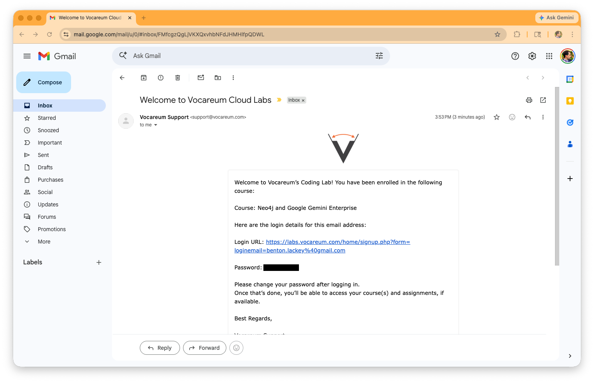
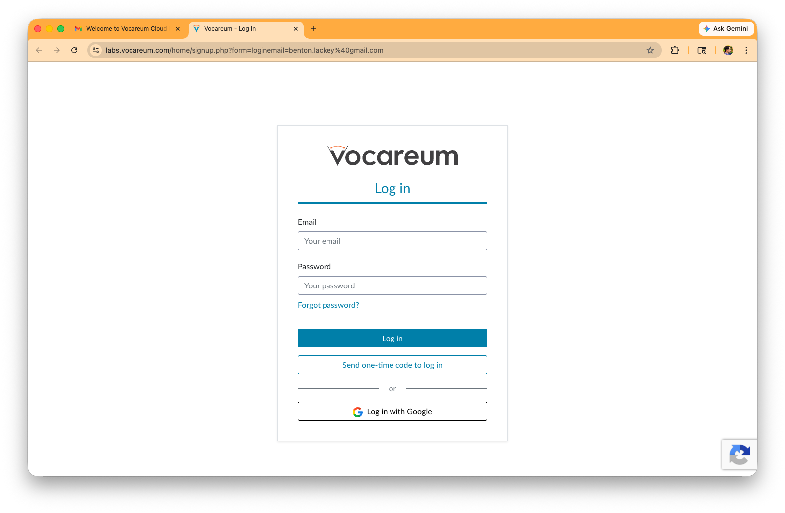
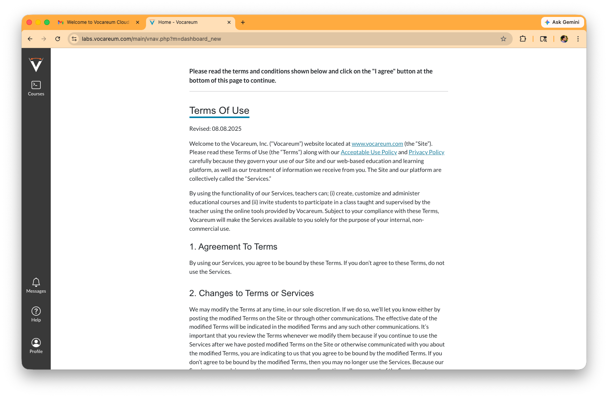
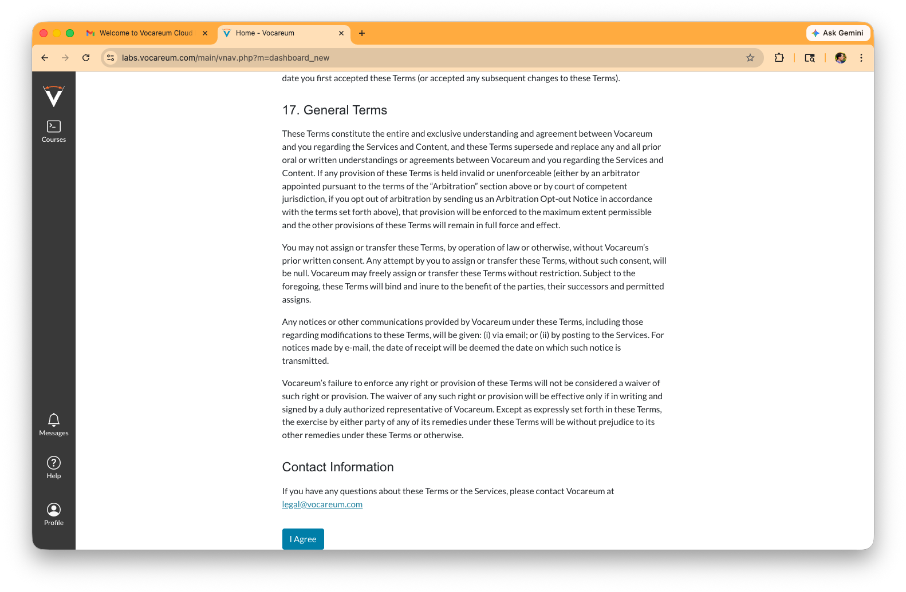
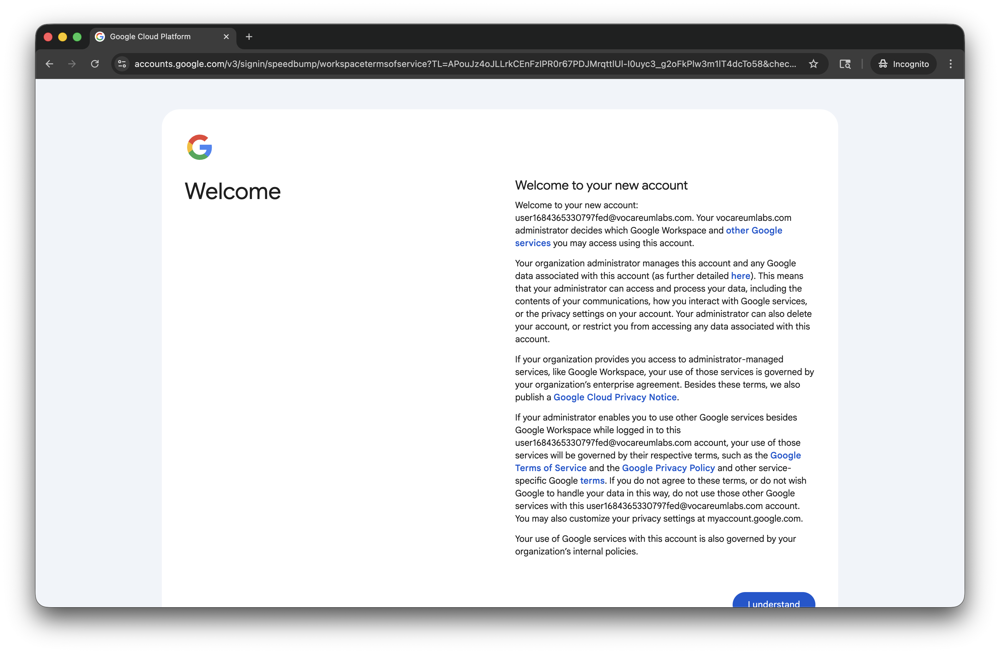
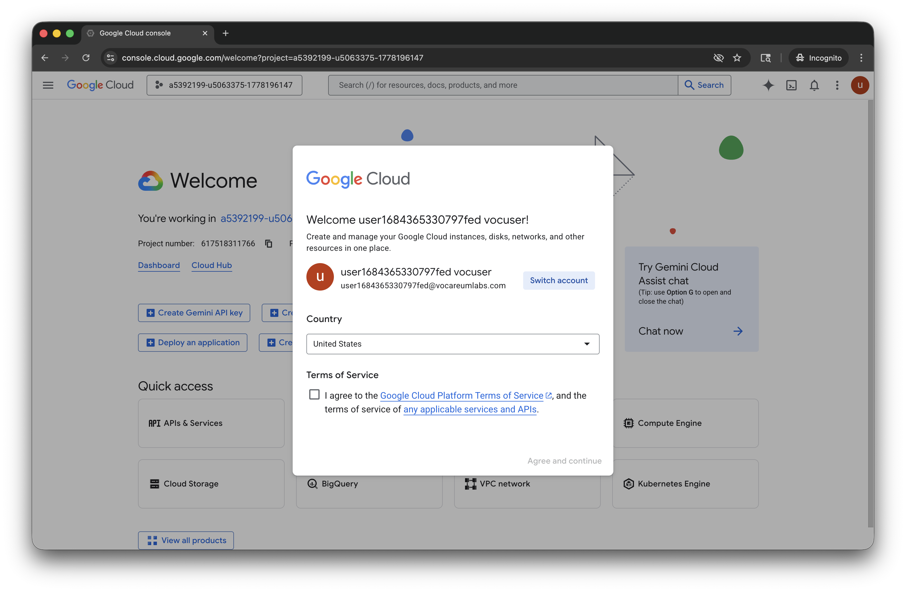
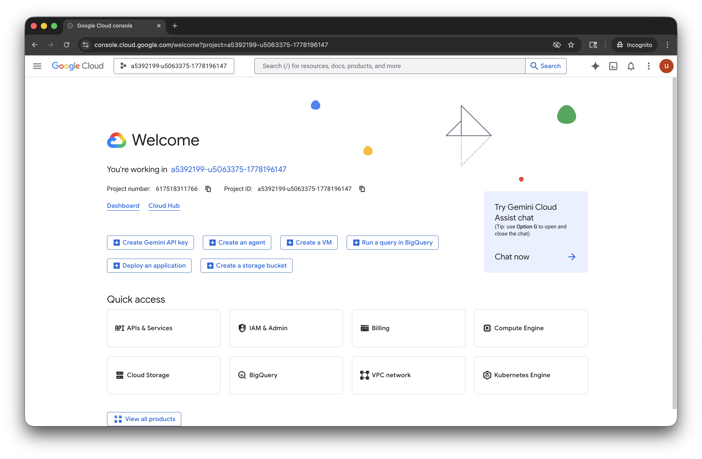

# Lab 0 - Sign In
We're using a learning platform called Vocareum to present the lab content.  You should have received an email from them.  Open the email and follow the link.

Enter your email address and the password provided.  Click "Log in."

Review the terms.

If they are acceptable, click "I agree" at the bottom.

Select the "Neo4j and Google Gemini Enterprise" course.

You should see a screen with some Google credentials along the side.  That is an ephemeral Google Cloud account.  You can use this to complete the lab.

Copy the link for the "Console."  You probably want to open it in an incognito window.  Alternatively you can log out of any Google account you're in and login with those credentials.

Enter your Vocareum credentials from the last step.  The email address will be something like user1684365330797fed@vocareumlabs.com.  Click next.

Enter the password.  Click "Next."

Review the terms.  Click "I understand" if they are acceptable.

We're now in the Google Cloud Console.  Click the check box if you agree to the terms.  Then click "Agree and continue."

Now you're all set, logged into a Google Cloud account.

In the next lab we'll deploy Neo4j.
