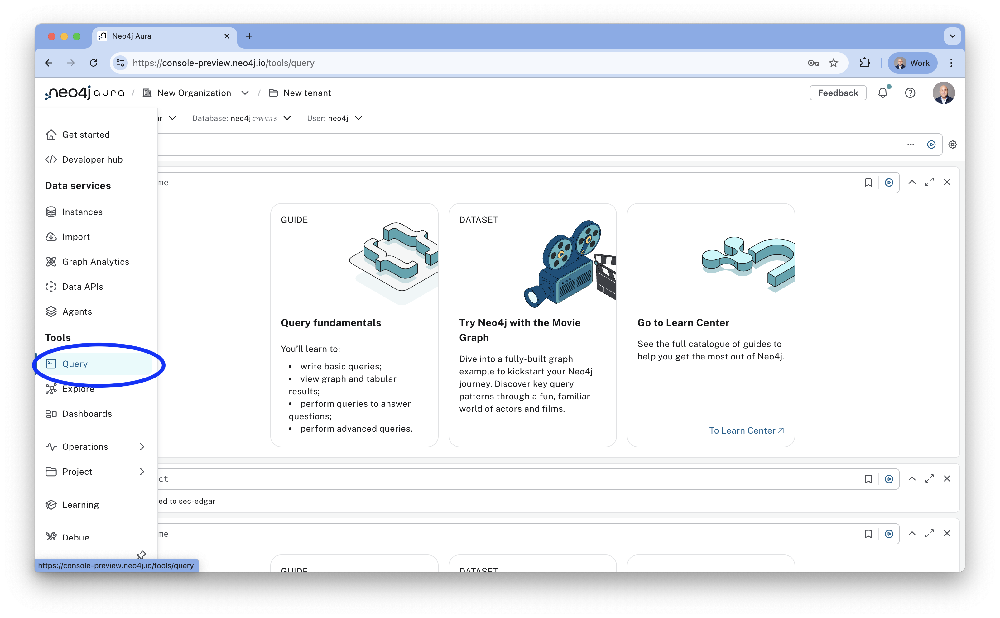
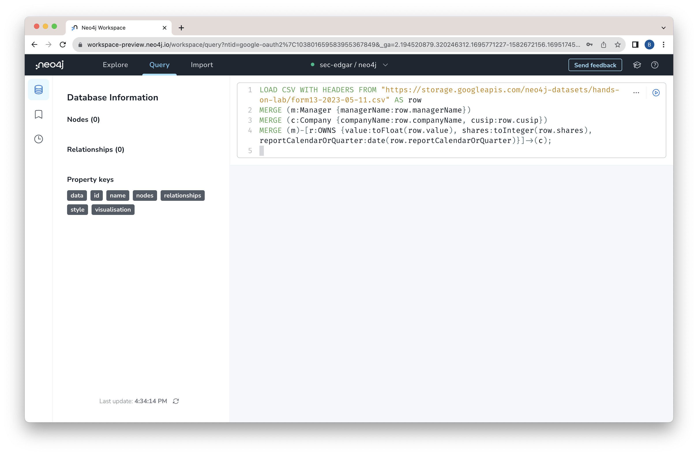
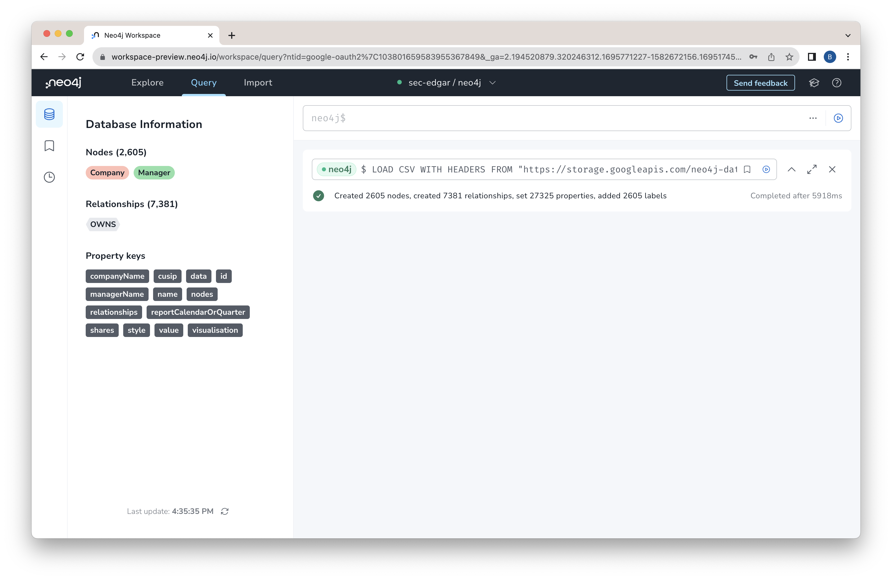
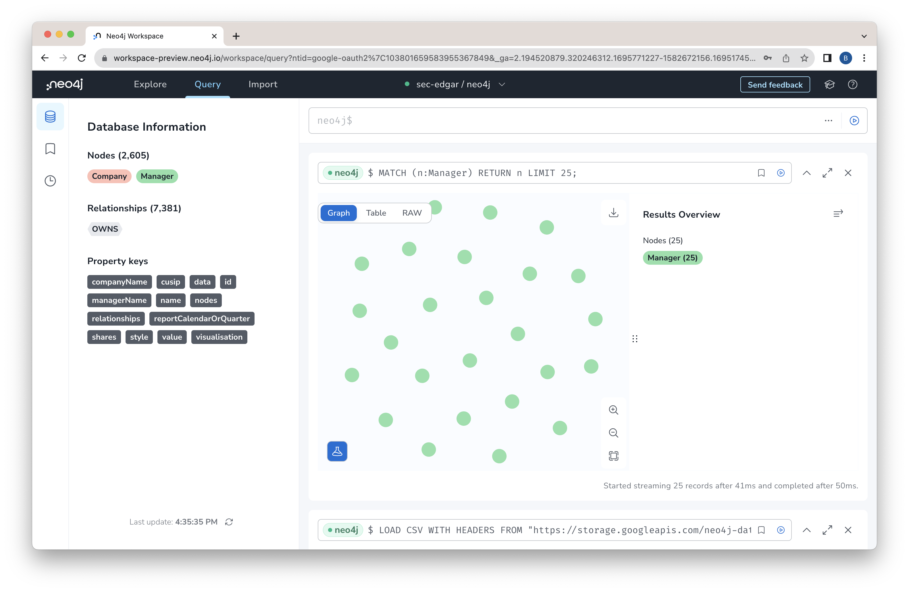
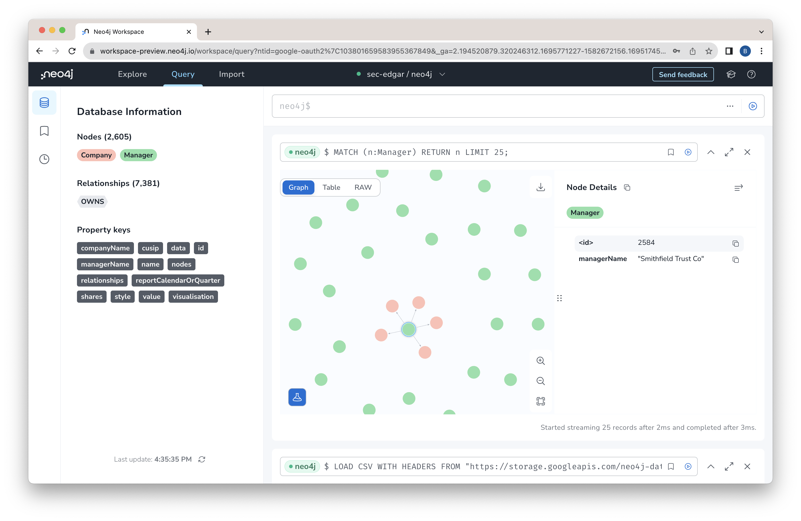
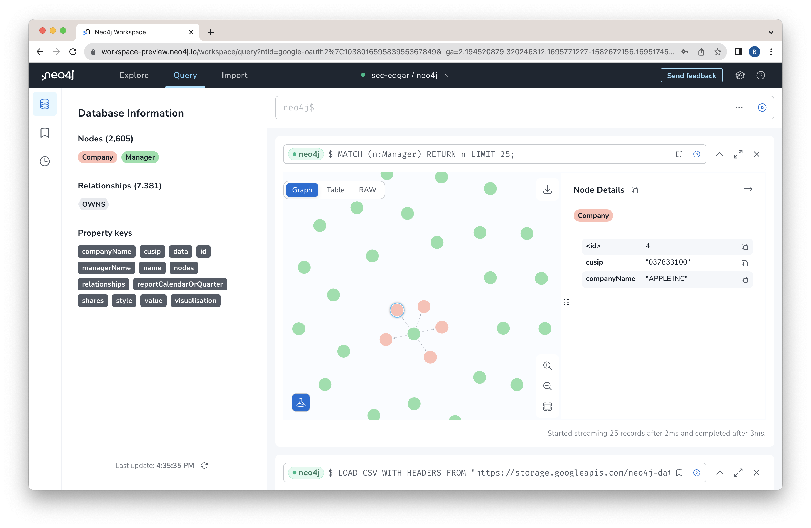
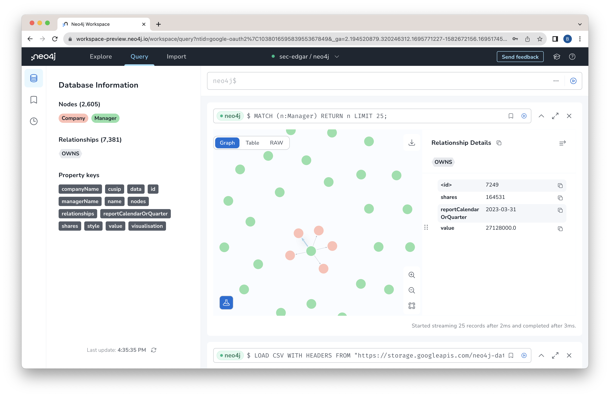
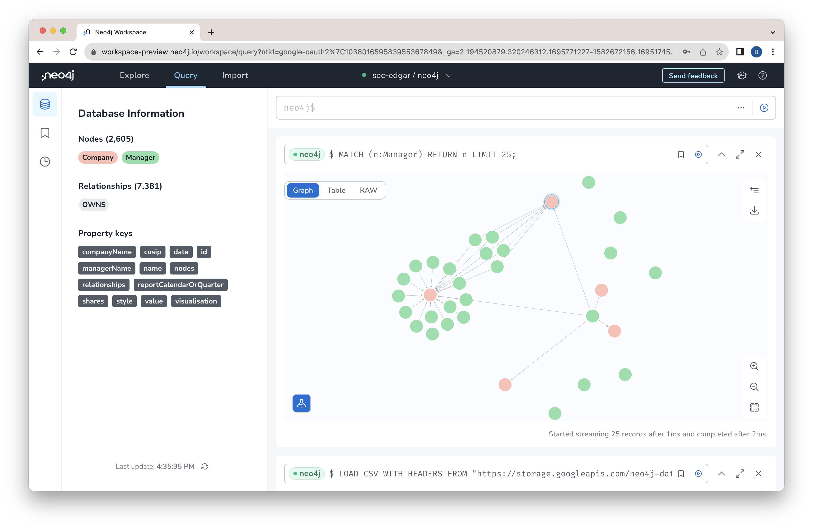
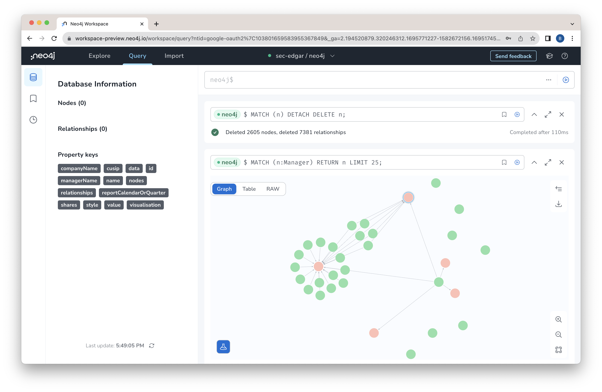

# Lab 4 - Moving Data

In this lab, we're going to take data from a Google Cloud Storage bucket and import it into Neo4j.  There are a few different ways to do this.  We'll start with a very naive LOAD CSV statement using a small dataset. Then we will try it again with a larger dataset using the Neo4j Data Importer, a great graphical way to import data.

The dataset is from the SEC's EDGAR database.  These are public filings of something called Form 13.  Asset managers with over \$100m AUM are required to submit Form 13 quarterly.  That's then made available to the public over http.  We don't have time to download those in the lab today as they take a few hours.  But, if you're curious, they're all available [here](https://github.com/neo4j-partners/neo4j-sec-edgar-form13).  We've filtered the data to only include filings over $10m in value.

## Simple Load Statement
For this portion of the lab, we're going to work with a subset of the data.  Our full dataset is a year of data.  However, we'll just be playing around with a a subset of a day's worth.  The data is [here](https://storage.googleapis.com/neo4j-datasets/hands-on-lab/form13-2023-05-11.csv).

You may want to download the data and load it into your favorite tool for exploring CSV files.  Pandas, Excel or anything else should be able to make short work of it.  Once you understand what's in the data, the next step would be to load it into Neo4j.

To load it in Neo4j, let's open the tab that has our Neo4j Workspace in it.  If you don't have that tab open, you can review the previous lab to get into it.

Make sure we are in the "Query" tab of the browser. If not you can select it from the side bar on the left.

We're going to run a Cypher statement to load the data.  Cypher is Neo4j's query language.  `LOAD CSV` is part of that and allows us to easily load CSV data.  Try copying this command into Neo4j Workspace.

    LOAD CSV WITH HEADERS FROM "https://storage.googleapis.com/neo4j-datasets/hands-on-lab/form13-2023-05-11.csv" AS row
    MERGE (m:Manager {managerName:row.managerName})
    MERGE (c:Company {companyName:row.companyName, cusip:row.cusip})
    MERGE (m)-[r:OWNS {value:toFloat(row.value), shares:toInteger(row.shares), reportCalendarOrQuarter:date(row.reportCalendarOrQuarter)}]->(c);

It should look like the following.  You can then press the blue triangle with a circle around it to run the job.

That will load the nodes and relationships from the file.

You'll now see the nodes, relationships and properties we loaded.  We have two kinds of nodes, manager and company.  Manager nodes are asset managers.  Company nodes are the companies that those asset manages buy shares of.  Managers are related to companies by the owns relationship.  Manager, company and owns all have properties that we can inspect as well.

Click on "Manager" under "Nodes" to automatically generate a new cypher query and run it.

You'll now see a subset of the managers we have in the database.  The query returns 25 of them.  It's limited because returning to many nodes in this visualization mode can make it hard to navigate.

Now, let's click on one of the managers.  Don't worry, it doesn't particularly matter which one.  Once we've clicked on it, right click and select "Expand."

When it expands, we can see what companies this manager owns shares in.  In this case, "Smithfield Trust Co" seems to only have five holdings.  Note that this data set only has holdings over $10m.  Smaller holdings were filtered out in pre-processing.

Try selecting a company now.

In this case, we see the company "APPLE INC" has CUSIP 037833100.

We can also click on the relationship, that is the line between the nodes to see detail on the transaction.

In this case, it appears we have a report from 2023-03-31 that 164,531 shares were purchased with a value of $27,128,000.

At this point, take some time to poke around the graph.  You can expand it by clicking the icon with two arrows pointing away from each other in the upper right.  You may also want to click on the "Company" node label to query those.

As you play around, you may start to see some of the structure in the graph with recurrent connections and interesting communities of managers who have similar holdings.

Now that we have some understanding of this portion of the dataset, we're going to delete it.  Then we'll load the full data set.  To delete all the nodes and relationships in the database, run this command:

    MATCH (n) DETACH DELETE n;

Now, all your data should be deleted.  Note that Workspace is still caching some property keys.

In the next section, we'll load more data.
