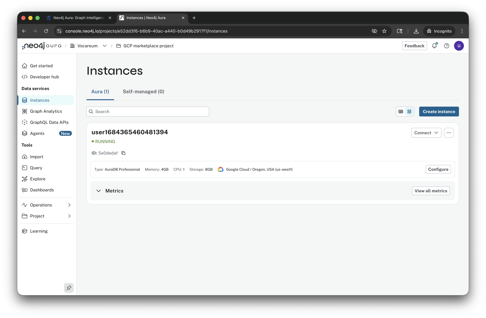
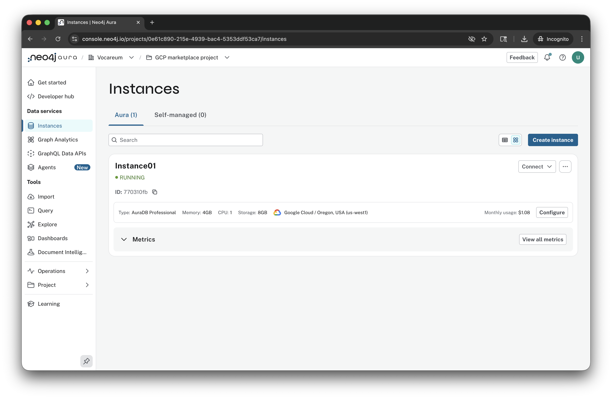
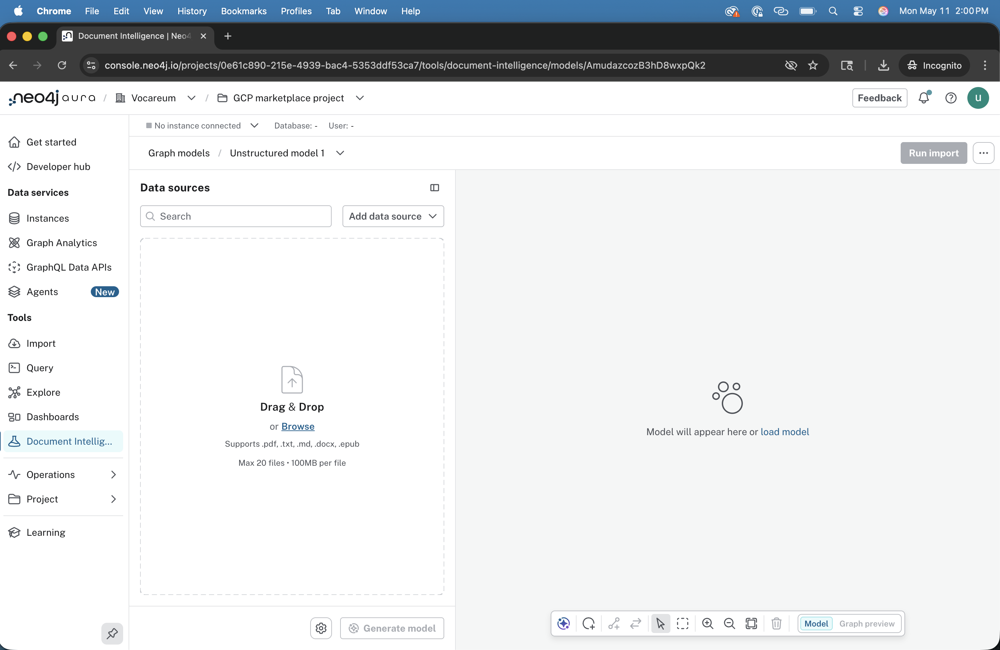
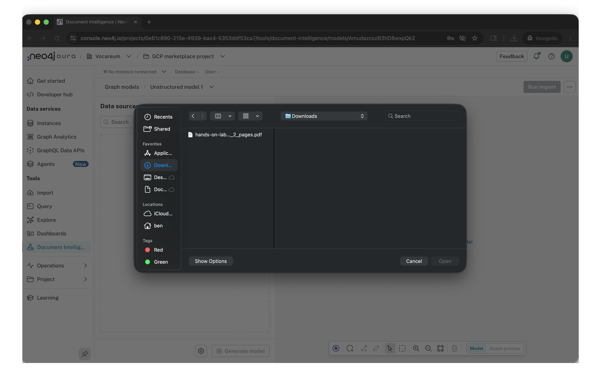
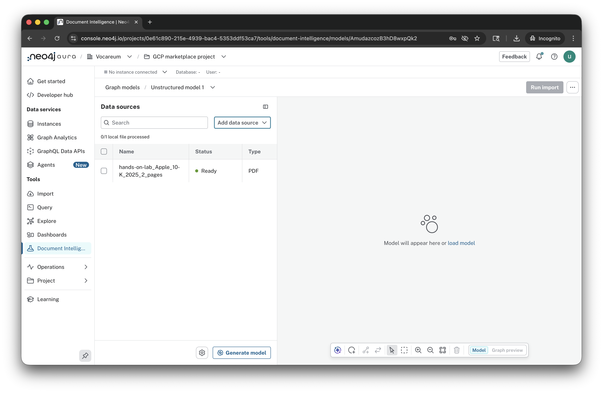
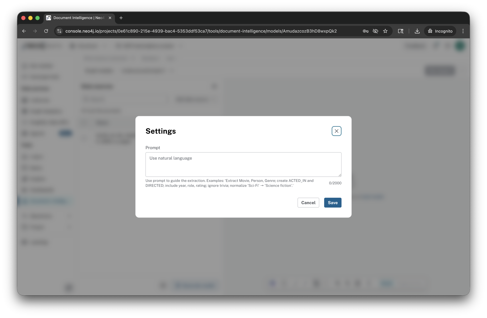
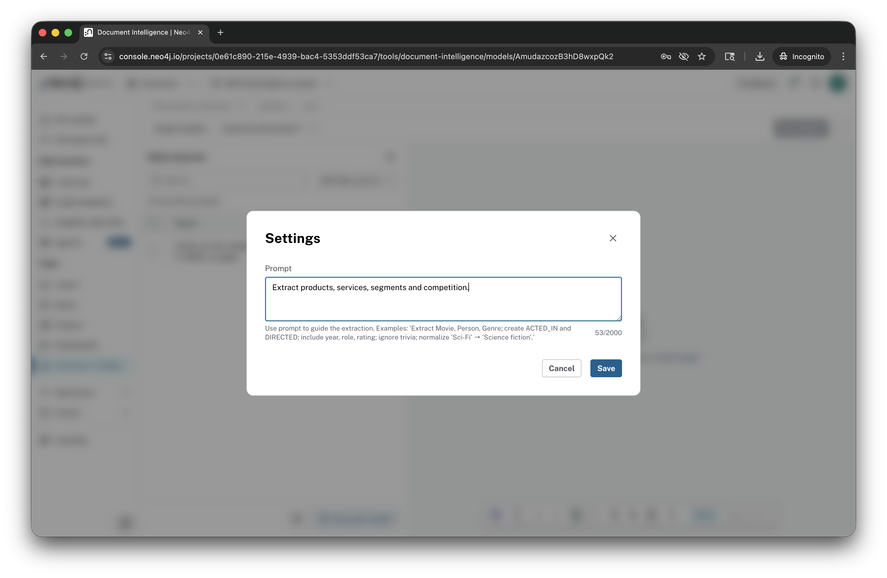
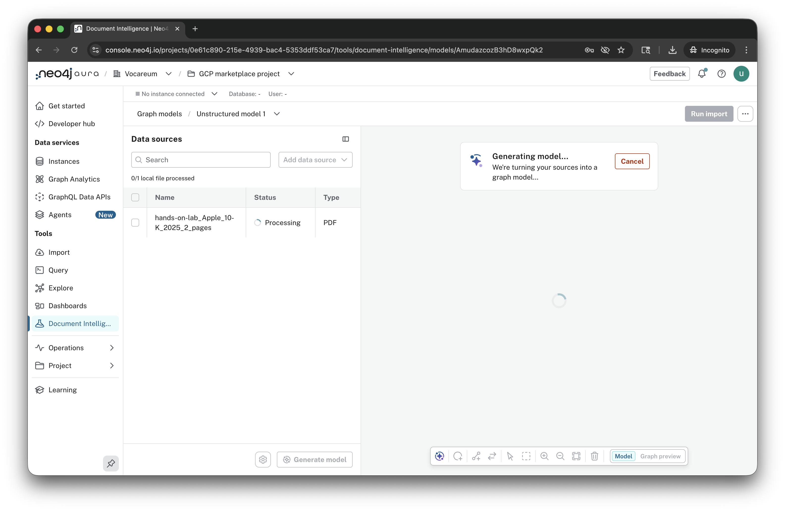

# Lab 6 - Document Intelligence

Document Intelligence is a new tool within Neo4j Aura.  It's currently in a private preview.  We've enabled your account for this lab with it.

Document Intelligence transforms documents into knowledge graphs stored in Neo4j.  It's an evolution of an approach Neo4j has been pioneering with AI since 2022.  Early integrations focused on using [Langchain to build these architectures](https://cloud.google.com/blog/topics/partners/build-intelligent-apps-with-neo4j-and-google-generative-ai).  Many of our customers using AI to create knowledge graph continue to use this approach.  It's code heavy and deeply customizable.

More recently Neo4j Labs, our experimental department, built a [LLM Graph Builder application](https://neo4j.com/labs/genai-ecosystem/llm-graph-builder/) that packaged this approach in a nice UI.

Document Intelligence is the next evolution of this, built into our Neo4j Aura product.

Let's start at our Neo4j Aura Console.  In the left menu, click on "Document Intelligence."

Click "Create graph model."

Click "Add data source."

Click "Local files."

Select the file "hands-on-lab_Apple_10-K_2025_2_pages.pdf"

Now click "Generate model."

For the promp enter:

    Extract products, services, segments and competition.

Click "Save."

The generator will run for a bit.

