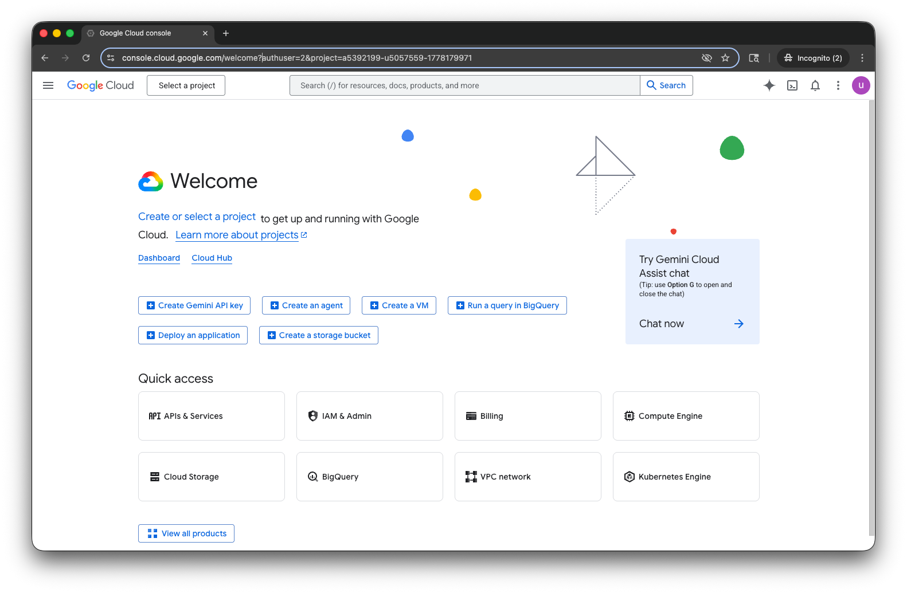

# Lab 6 - Neo4j Agent

In this lab we're going to use the Neo4j Agent in Google Cloud Marketplace with Gemini Enterprise.

The agent is an MCP server that can interact with a Neo4j Aura instance.  It can perform CRUD operations available through the Cypher language.  The agent takes natural language as input and converts that to the appropriate Cypher before passing the query to Neo4j Aura.

The Agent is available in the Google Cloud Marketplace.  It's wrapped in the Agent to Agent (A2A) protocol.  This means we can deploy it within a Gemini Enterprise environment.

So, let's get started.  We're going to start at the [Google Cloud Console](https://console.cloud.google.com/).  In the search bar at the top, type "Neo4j Agent."

