# Lab 1 - Sign In

Congratulations! You logged into Vocareum and made it here! The next step is going to be starting up your Microsoft Azure environment.

Open a window back on the Vocareum assignments page [here](https://labs.vocareum.com/main/nav.php?m=course_new&cid=213828). Scroll down to the bottom of that window.

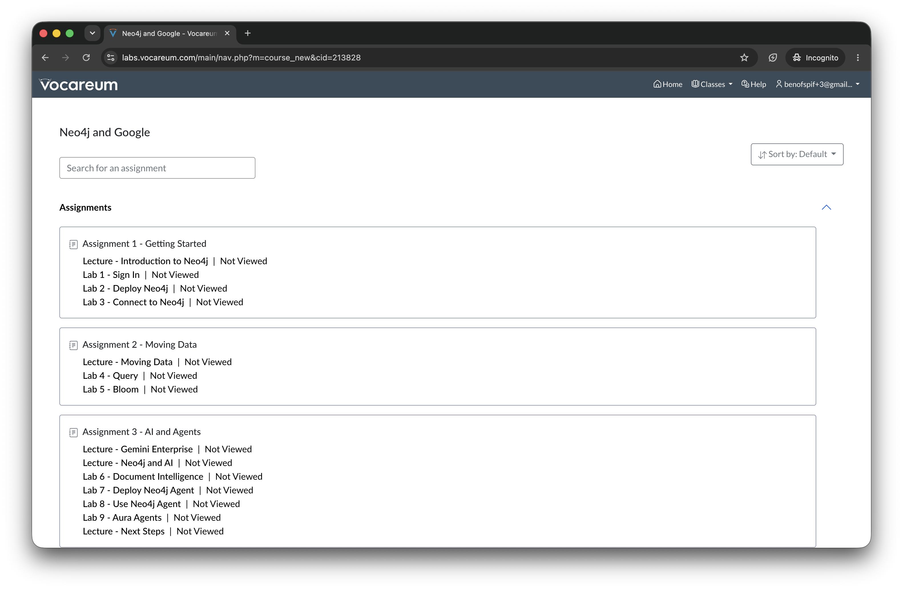

Click on "Cloud Environment" at the very bottom.

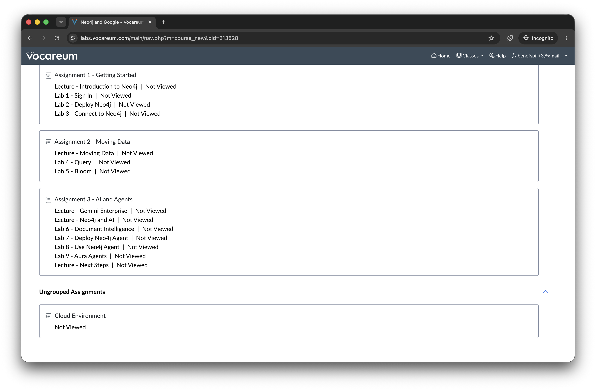

The button in the upper right should say "Starting Lab."  Give that a moment to run.

Click the GCP on the left to open up a screen with detail.

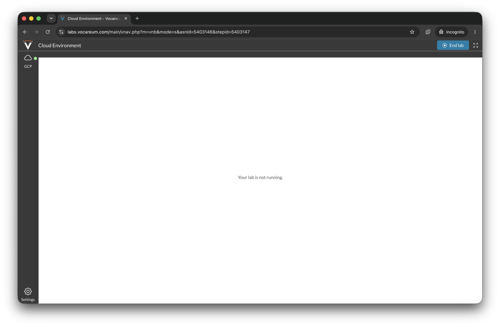

You should see Google credentials along the left side.  That is an ephemeral Google Cloud account.  You can use this to complete the lab.

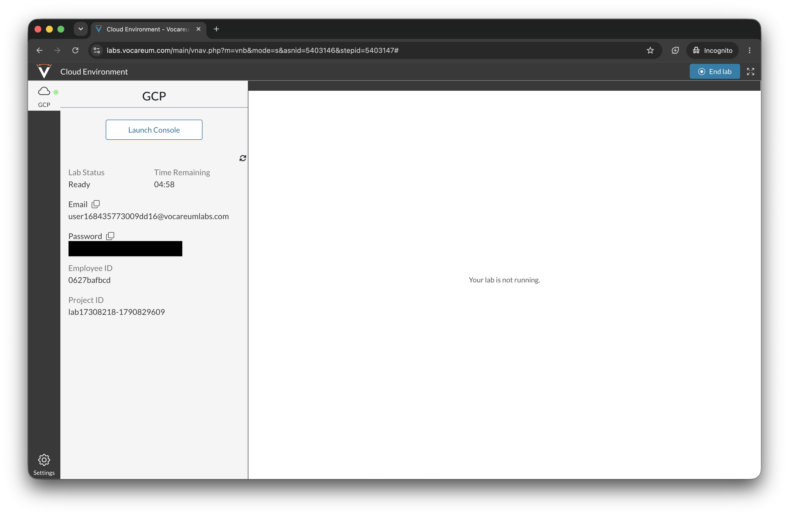

We're now going to open the Google Cloud Console at [https://console.cloud.google.com/](https://console.cloud.google.com/)

You probably want to open it in an incognito window.  Alternatively you can log out of any Google account you're in and login with those credentials.

Enter your Vocareum credentials from the last step.  The email address will be something like user1684365330797fed@vocareumlabs.com.  Click "Next."

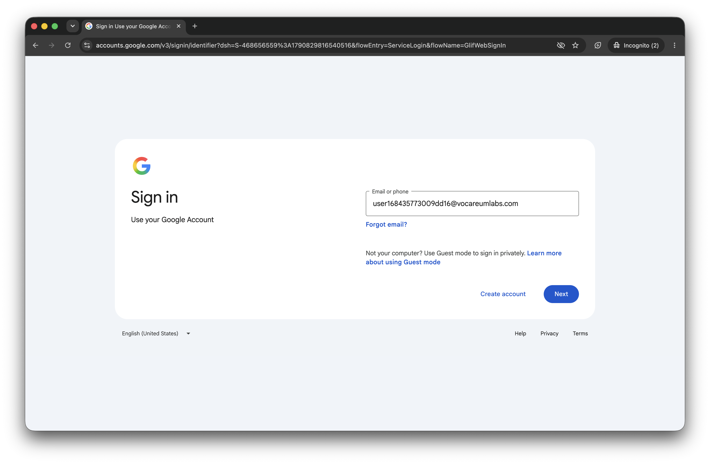

Enter the password.  Click "Next."

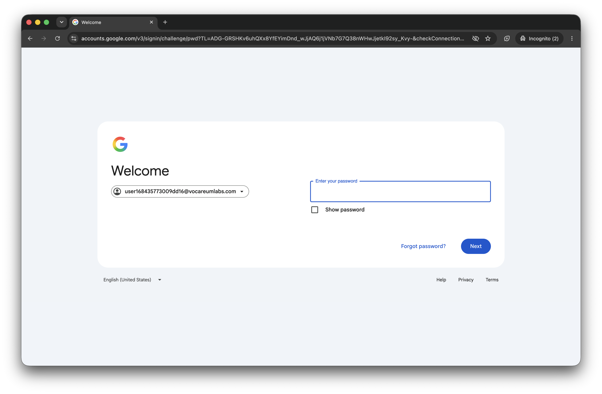

Enter the Employee ID and click "Next."

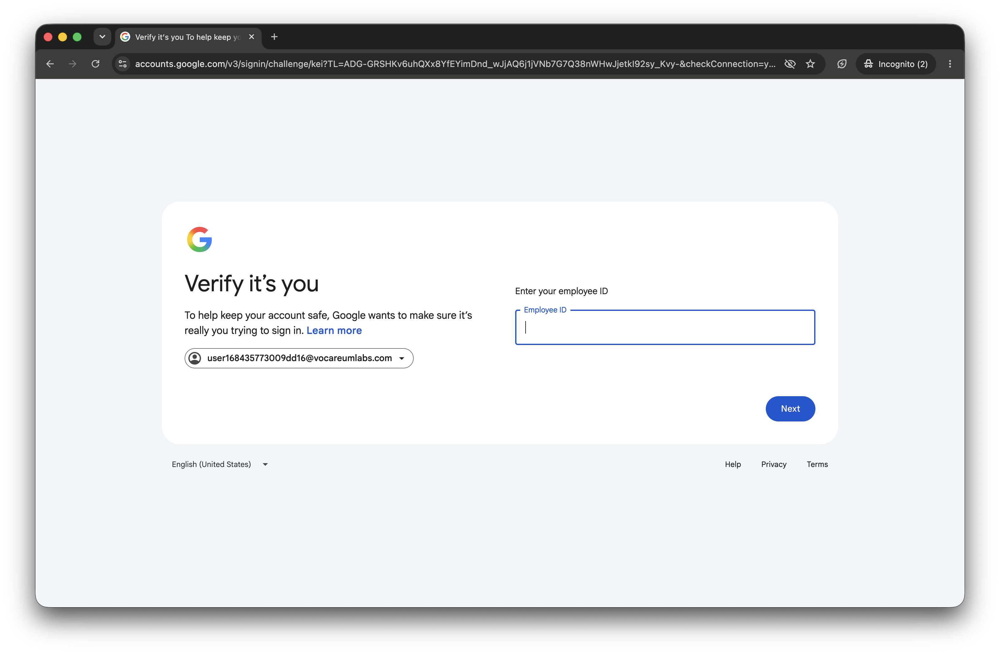

We're now on the Google Cloud landing page.  Click "Console" at the top.

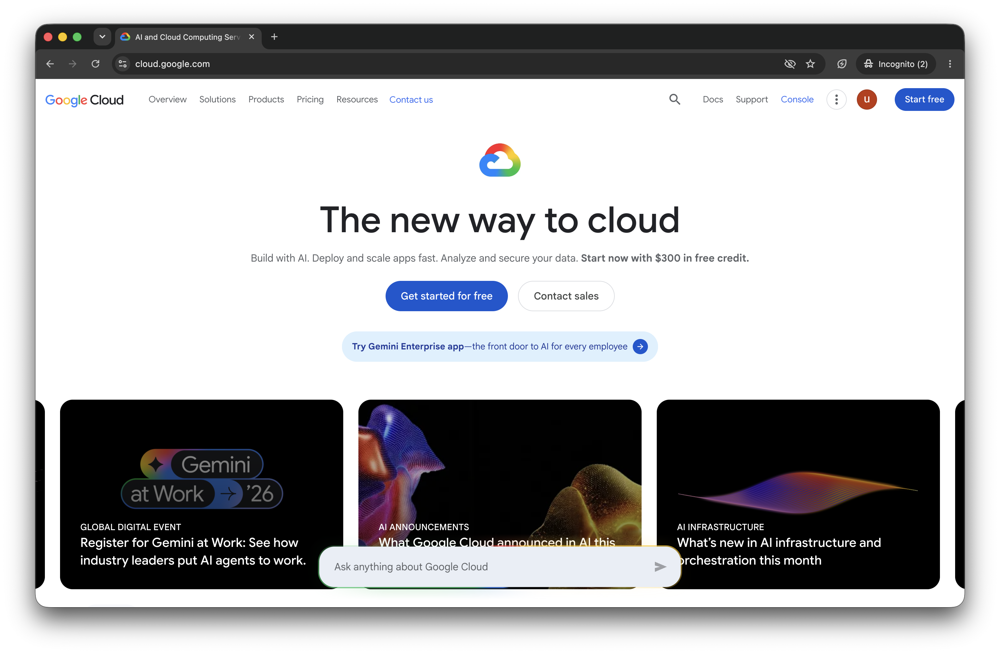

Now we're logged in.  Click "Select a project" at the top.

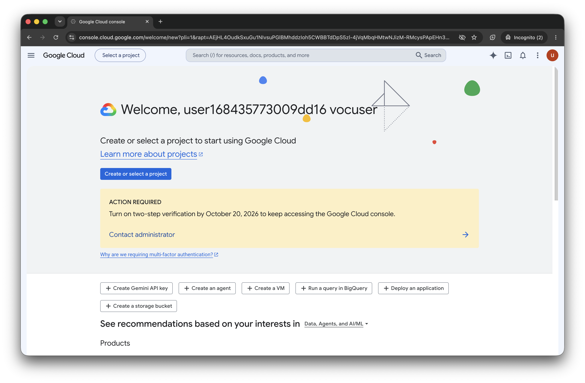

You should see one project.  Select that.

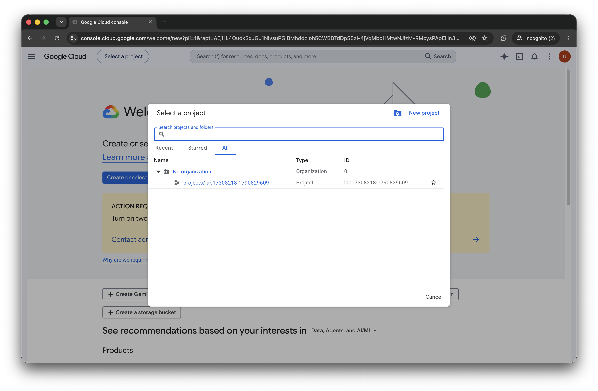

Now you're all set, logged into a Google Cloud account.

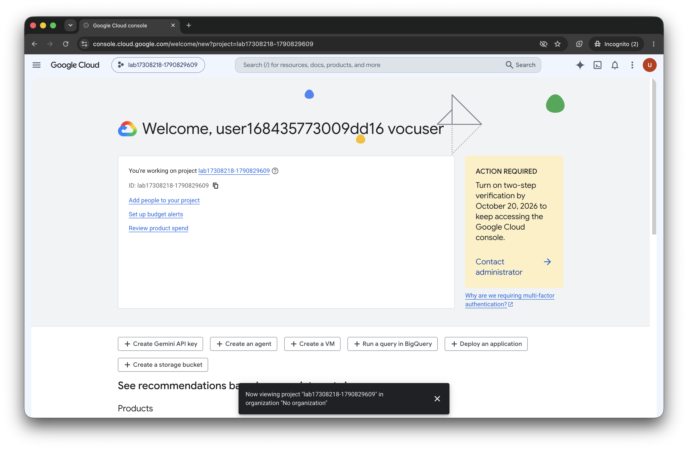

In the next lab we'll deploy Neo4j.
